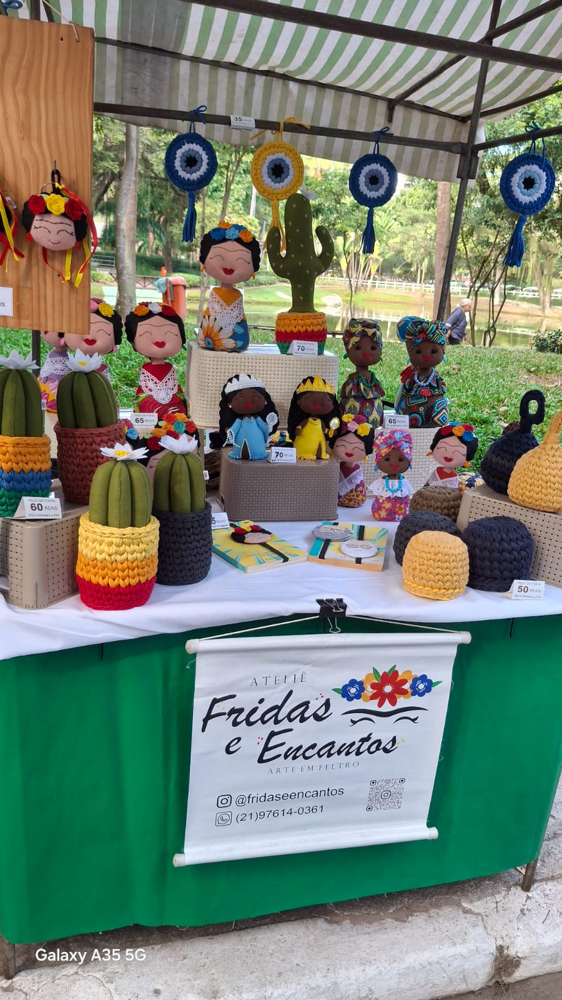

# Casa do Artesão de Niterói — Front-end

Este é o front-end do projecto **Casa do Artesão de Niterói**, desenvolvido com o objectivo de apresentar informações sobre a Casa do Artesão, divulgar as feiras de artesanato, valorizar o trabalho dos artesãos locais e facilitar o acesso aos locais das feiras por meio de uma interface moderna, responsiva e visualmente agradável.

A proposta do site é aproximar visitantes, artesãos e interessados nas actividades da Casa do Artesão, reunindo numa única página informações institucionais, contactos, fotos, mapa interativo e orientações sobre como participar das feiras.

---

## Objectivo do projecto

O objectivo deste front-end é criar uma página informativa e acessível para a Casa do Artesão de Niterói, destacando a importância do artesanato local, da economia criativa e da cultura da cidade.

A página foi pensada para apresentar:

- informações sobre a Casa do Artesão;
- dados sobre as feiras de artesanato;
- galeria com fotos das feiras e dos produtos artesanais;
- mapa interativo com a localização das feiras;
- orientações para artesãos interessados em participar;
- canais oficiais de contacto;
- identidade visual inspirada no artesanato e na cultura local.

---

## Tecnologias utilizadas

O front-end foi desenvolvido utilizando as seguintes tecnologias:

- HTML5;
- CSS3;
- JavaScript;
- Vite;
- Tailwind CSS;
- Leaflet;
- OpenStreetMap.

---

## Estrutura do projecto

A estrutura principal do front-end está organizada da seguinte forma:

```txt
front-end/
├── public/
│   └── img/
│       ├── logo1.jpg
│       ├── logo3.png
│       ├── feira-01.jpg
│       ├── feira-02.jpg
│       ├── feira-03.jpg
│       ├── feira-04.jpg
│       ├── feira-05.jpg
│       ├── feira-06.jpg
│       └── feira-07.jpg
├── src/
│   ├── main.js
│   └── style.css
├── index.html
├── tailwind.config.js
├── vite.config.js
├── package.json
└── README.md
```

> Observação: caso o ficheiro `style.css` esteja fora da pasta `src`, é necessário ajustar a estrutura acima ou o caminho de importação dentro do `main.js`.

---

## Como rodar o projecto

Para executar o front-end localmente, é necessário ter o **Node.js** instalado na máquina.

### 1. Aceder à pasta do front-end

No terminal, entre na pasta onde está o front-end:

```bash
cd front-end
```

Caso o nome da pasta seja diferente, substitua `front-end` pelo nome correcto da pasta do projecto.

---

### 2. Instalar as dependências

Execute o comando abaixo para instalar as dependências do projecto:

```bash
npm install
```

Este comando irá instalar as bibliotecas necessárias para o funcionamento do projecto, incluindo o Vite, Tailwind CSS e Leaflet.

---

### 3. Rodar o servidor de desenvolvimento

Depois de instalar as dependências, execute:

```bash
npm run dev
```

Após executar o comando, o Vite irá mostrar no terminal um endereço local para abrir o site no navegador.

Normalmente, o endereço aparece parecido com este:

```txt
http://localhost:5173/
```

Abra esse endereço no navegador para visualizar o projecto.

---

### 4. Parar o servidor

Para parar o servidor de desenvolvimento, volte ao terminal e pressione:

```txt
Ctrl + C
```

---

## Organização das imagens

As imagens utilizadas no site devem ficar dentro da pasta:

```txt
public/img/
```

No HTML, os caminhos das imagens devem começar com `/img/`.

Exemplo de uso da logo:

```html

```

Exemplo de uso de uma imagem da galeria:

```html

```

As imagens da galeria seguem uma nomenclatura simples e organizada:

```txt
feira-01.jpg
feira-02.jpg
feira-03.jpg
feira-04.jpg
feira-05.jpg
feira-06.jpg
feira-07.jpg
```

Essa organização facilita a manutenção do projecto e permite adicionar novas fotos futuramente sem confundir os caminhos dos ficheiros.

---

## Secções da página

A página foi organizada em secções para facilitar a navegação e apresentar as informações de forma clara.

As principais secções são:

- **Header**: contém a logo da Casa do Artesão e o menu de navegação;
- **Hero**: apresentação inicial do site;
- **Sobre**: explicação sobre a Casa do Artesão e a sua importância;
- **Galeria**: espaço visual para fotos das feiras, bancas e peças artesanais;
- **Números**: área com dados informativos sobre o projecto;
- **Feiras**: lista de feiras com local, dias, horários e bairro;
- **Mapa**: mapa interativo com os pontos das feiras;
- **Como participar**: orientação para artesãos interessados em participar;
- **Capacitação e gestão pública**: informações institucionais;
- **Contacto**: canais oficiais para comunicação;
- **Rodapé**: informações finais e logos institucionais.

---

## Funcionalidades implementadas

O front-end possui as seguintes funcionalidades:

- layout responsivo para diferentes tamanhos de tela;
- navegação por âncoras entre as secções da página;
- cards de feiras gerados dinamicamente com JavaScript;
- informações de local, dias e horários das feiras;
- links para abrir a localização das feiras no Google Maps;
- mapa interativo utilizando Leaflet;
- uso do OpenStreetMap como base do mapa;
- modal para exibição do mapa;
- galeria de fotos para valorizar o trabalho artesanal;
- uso de cores personalizadas com Tailwind CSS;
- botões estilizados;
- cards com bordas arredondadas e sombras suaves;
- identidade visual inspirada no artesanato local.

---

## Mapa interativo

O projecto possui um mapa interativo que apresenta os pontos das feiras de artesanato de Niterói.

As informações das feiras são organizadas no ficheiro JavaScript principal, contendo dados como:

- nome da feira;
- local;
- dias de funcionamento;
- horário;
- bairro;
- coordenadas geográficas.

Cada feira também possui um botão que permite abrir a localização diretamente no Google Maps, facilitando o acesso dos visitantes aos pontos das feiras.

---

## Galeria de fotos

A galeria foi criada para destacar imagens reais das feiras, bancas e produtos artesanais.

Essa secção tem como objectivo tornar o site mais visual, atractivo e próximo da realidade dos artesãos. As fotos ajudam a mostrar a variedade dos produtos, as cores, os detalhes das peças e o ambiente das feiras.

A imagem principal da galeria pode ser usada para destacar uma banca ou uma produção artesanal com maior impacto visual. As demais imagens podem ser organizadas em cards menores, criando uma composição mais dinâmica e profissional.

---

## Identidade visual

A identidade visual do front-end foi construída com base numa estética artesanal, acolhedora e cultural.

A paleta de cores utiliza:

- tons claros e creme como base;
- tons de madeira e terracota como cores principais;
- verde e azul como cores secundárias;
- cores quentes para destacar botões e elementos importantes.

O objectivo visual é transmitir uma sensação de acolhimento, criatividade, cultura, cuidado manual e valorização do artesanato local.

---

## Tailwind CSS

O projecto utiliza Tailwind CSS para a estilização da interface.

As cores personalizadas foram definidas para manter uma identidade visual consistente ao longo da página, utilizando nomes relacionados ao tema do projecto, como:

- `base`;
- `papel`;
- `creme`;
- `madeira`;
- `madeira-escura`;
- `terracota`;
- `azul-casa`;
- `verde-profundo`;
- `texto`;
- `texto-suave`.

Essa organização facilita a manutenção do estilo e permite reutilizar as mesmas cores em diferentes partes do layout.

---

## JavaScript

O JavaScript é utilizado para tornar a página mais dinâmica.

As principais responsabilidades do ficheiro JavaScript são:

- armazenar os dados das feiras;
- gerar automaticamente os cards das feiras;
- abrir e fechar o modal do mapa;
- inicializar o mapa interativo;
- adicionar marcadores no mapa;
- criar links para localização das feiras no Google Maps.

---

## Comandos principais

Comandos mais utilizados durante o desenvolvimento:

```bash
npm install
```

Instala as dependências do projecto.

```bash
npm run dev
```

Inicia o servidor de desenvolvimento.

```bash
npm run build
```

Gera uma versão final optimizada do projecto para produção.

```bash
npm run preview
```

Permite visualizar localmente a versão gerada pelo build, caso esse script esteja configurado no `package.json`.

---

## Observações importantes

- As imagens devem ficar dentro da pasta `public/img/`.
- No HTML, o caminho correcto das imagens deve começar por `/img/`.
- A logo principal deve estar salva como `logo1.jpg`.
- A imagem institucional do rodapé deve estar salva como `logo3.png`.
- As fotos da galeria devem seguir o padrão `feira-01.jpg`, `feira-02.jpg`, `feira-03.jpg` e assim por diante.
- Caso novas feiras sejam adicionadas, os dados devem ser actualizados no ficheiro JavaScript responsável pela lista e pelo mapa.
- Caso novas imagens sejam adicionadas à galeria, é recomendado manter nomes simples e padronizados.
- O projecto deve ser executado pelo Vite durante o desenvolvimento.

---

## Possíveis problemas e soluções

### As imagens não aparecem

Verifique se as imagens estão dentro da pasta:

```txt
public/img/
```

E se o caminho no HTML começa com:

```txt
/img/
```

Exemplo correcto:

```html

```

Exemplo que pode causar erro no Vite:

```html

```

---

### O mapa não aparece corretamente

Verifique se as dependências foram instaladas com:

```bash
npm install
```

Depois execute novamente:

```bash
npm run dev
```

Também é importante verificar se o elemento com `id="map"` existe no HTML e se o JavaScript está sendo carregado corretamente.

---

### O site não abre no navegador

Confirme se o servidor de desenvolvimento está rodando com:

```bash
npm run dev
```

Depois copie o endereço exibido no terminal e abra no navegador.
